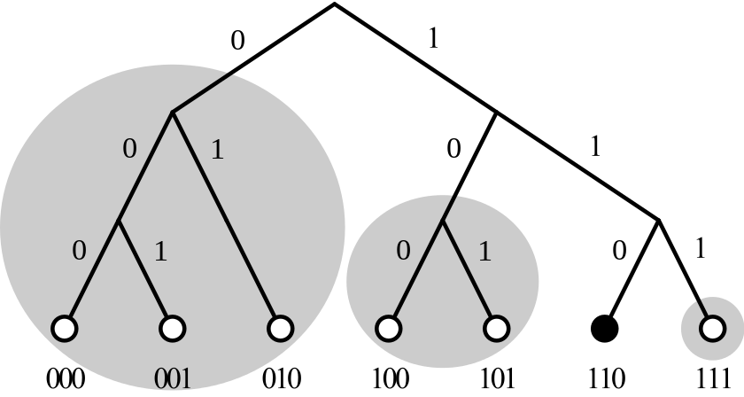

# Kademila DHT 개요 & 내부 동작 원리

// http://gleamly.com/article/introduction-kademlia-dht-how-it-works, https://en.wikipedia.org/wiki/Kademlia의 번역본입니다.

## 개요

Kademila는 오늘날 많이 쓰이고 있는 유명한 peer-to-peer(P2P)(피어 투 피어) DHT입니다.

DHT : Distributed Hash Table (분산 해시 테이블)

## Kademila 용어

* NODE : node는 Kademila DHT 네트워크에 참여하는 컴퓨터입니다.

* pair (KV) : DHT는 KV형태(Key & Value, 즉 키와 값)로 데이터를 저장하며, Kademila에서도 마찬가지 입니다. Key는 Kademila 네트워크에서 값을 찾기 위한 고유 키이며, 값은 DHT에 실제 저장되는 데이터입니다.

* LookUP : LookUP은 Kademila 네트워크에서 주어진 키에 대한 실제 값을 찾는 과정입니다.

* Data/Content : Kademila DHT에 pair(KV) 형태로 저장되어 있는 실제 데이터를 의미합니다.

## 왜 Kademila를 사용하는가?
 
 Kademila는 다른 DHT에서 제공하지 않는 여러 기능들을 제공합니다.

 Kademila에서 지원하는 기능들: 

* Node간 주고받는 데이터를 최소화시킵니다.

* 네트워크에 속한 node, 인접한 node 등에 대한 설정 정보가 자동적으로 Kademila 네트워크에 확산됩니다.

* Kademila 네트워크의 node들은 다른 node를 통해 파악됩니다. 이 기능을 통해 적은 비용으로 node간 경로를 탐색할 수 있습니다. 

* Kademila는 작동하지 않는 node의 timeout을 피할 수 있는 병렬적이고, 비동기적인 쿼리를 제공합니다.

* Dos 공격을 방지할 수 있습니다.

## Key

 Kademila는 node와 데이터를 식별하기 위해 160 비트 key를 이용합니다. 네트워크에 참여하는 컴퓨터는 각각 160 비트 NodeId 키를 가집니다. 위에서 언급한 바와 같이 Kademila는 pair(KV)로 데이터를 저장하기 때문에 160 비트 key를 사용해서 데이터를 식별하기도 합니다.

## Distance
 Kademila는 두 node간의 '거리'를 계산합니다. 이 '거리'는 두 node id의 XOR으로 계산되며, 정수형 값을 가지게 됩니다. Key와 node id는 같은 형태, 길이의 정수형 값을 가지고 있기 때문에 XOR연산이 가능합니다. 일반적으로 node id는 전체 네트워크에서 각 node를 식별할 수 있도록 무작위로 정해진 큰 정수형 값을 가지게 됩니다.(UUID)
  
  이러한 원리에 따라 물리적으로 거리가 먼 node일지라도, node id 값이 비슷하다면 논리적으로는 이웃에 위치할 수 있습니다. 

  XOR은 아래의 이유로 '거리' 계산에 사용됩니다.

  * 임의의 한 node와 그 node 자신에 대한 거리는 0이 됩니다.
  * XOR연산은 대칭성을 가집니다: A에서 B 거리를 계산한 결과는 B에서 A거리를 계산한 것과 동일합니다.
  * 삼각 부등식이 성립합니다: A,B,C node가 주어졌을 때, A와 B사이의 거리는 A와C, C와B의 거리의 합과 같거나 작습니다.

  XOR연산은 연산이 간단하고 빠르면서도 위의 세가지 조건을 모두 만족시킵니다.

  Kademila 탐색 작업을 반복할때마다 한 비트씩 탐색 대상에 가까워지게 됩니다. 2**n개의 node를 가지고 있는 일반적인 Kademila network에서는 최대 n번 탐색 작업을 반복하면 임의의 node를 찾을 수 있습니다.

## Routing Table
 * 아래에 내용에서는 단순화된 key를 이용합니다.

 Kademila routing table는 각 node id들의 각 비트를 저장한 리스트를 포함하고 있습니다. 리스트의 모든 항목은 다른 node들의 위치에 대한 중요한 정보를 저장합니다. 리스트의 각 항목은 일반적으로 다른 node의 IP 주소, 포트, Node Id를 저장합니다. 
  
  모든 리스트는 특정 node의 거리와 대응됩니다. 

## Protocol Messages

 Kademila는 4가지의 메시지를 가지고 있습니다. 

* PING : Node가 작동하고 있는 상태인지를 확인한다.

* Store : 한 node에 키와 값(pair KV) 데이터를 저장합니다.

* FIND_NODE : 요청한 Key에 제일 가깝게 위치한 k node 들을 반환합니다.

* FIND_VALUE : FIND_NODE와 같은 역할을 하나, 요청한 Key에 해당하는 데이터가 있다면, 그 데이터를 반환합니다. 

 요청에 의해 반환되는 RPC 메시지는 발신자가 지정한 랜덤한 값을 포함합니다. 랜덤으로 정해진 이 값은 요청한 메시지와 응답된 결과를 대응시키기 위해 사용됩니다. 

 ## Locating Nodes 

 Node 탐색은 동기적으로 이루어집니다. 동시에 일어나는 탐색 요청은 α로 나타내어지며, 일반적인 α의 값은 3입니다. Node은 원하는 key 값에 가장 가까운 α개의 node에 FIND_NODE 요청을 전송합니다. FIND_NODE 요청을 받은 node들은 자신의 k-buckets을 탐색하여 key 값에 가장 가까운 k개의 node들을 반환합니다. 탐색 요청자는 요청 결과를 저장하며, k개의 가장 가까운 node id를 저장합니다.  

  그 후, 탐색 요청자는 저장하고 있는 node id들을 선택하여 각 node들이 위와 같은 요청을 하도록 합니다. 이러한 작업이 반복됩니다. 각 node들은 자신 주위에 있는 node들에 가장 잘 알고 있기 때문에 이러한 작업이 반복될 수록 key 값에 더 가까운 node를 찾게 됩니다.

탐색 작업은 전 탐색 결과보다 key에 더 가까운 node들이 없을때까지 반복됩니다. 탐색이 중지되었을때 저장되어 있는 k node들이 원하는 key에 가장 가까운 node가 됩니다.

## 작성자

박재성
	* jspark14151@gmail.com

